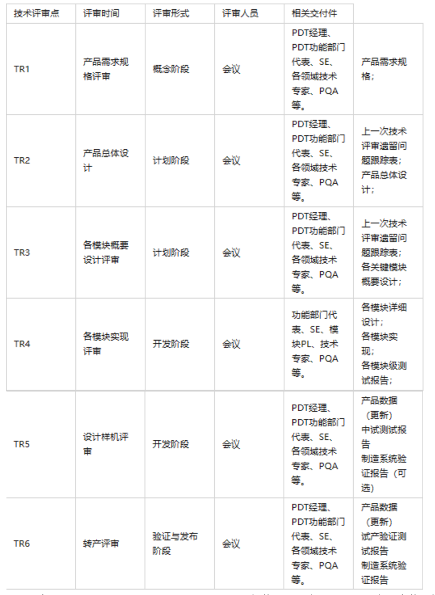

# 开发环境

- github:
    - git安装与初始化
    - 学习记录/作业提交
    - 项目地址：https://github.com/rf-cyber/SXLNLP.git
- gpu使用
    - 驱动安装：
        - 使用驱动更新工具更新：GeForce Experience
        - Nvidia驱动：https://www.nvidia.com/Download/index.aspx
    - CUDA安装：
        - 官网：https://developer.nvidia.com/cuda-downloads
- anaconda：
    - 官网下载：https://anaconda.org.cn/
    - 基础配置：
        - 配置源：https://mirrors.tuna.tsinghua.edu.cn/help/anaconda/
        - 帮助命令：conda [command] --help
        - 查看基础配置：conda config --show
        - 清理基础配置缓存：conda clean -i
        - 查看虚拟环境：conda env list
        - 更新所有包：conda update --all
        - 更新自身：conda update conda
        - 更新整个Anaconda到最新稳定版：conda update Anaconda
        - 打包/释放环境
            - 打包环境：conda pack -n env_name -o env_name_out.tar.gz
            - 释放环境：
                - 方式一：conda install --use-local env_name_out.tar.gz
                - 方式二：tar -zxvf env_name_out.tar.gz -C <env_path>/{new_env_name}
    - 操作参考：https://blog.csdn.net/chenxy_bwave/article/details/119996001
    - 创建gpu环境
        - anaconda默认一个缺省为base的环境。
        - 创建虚拟环境：
            - conda create -n
              env_name [--prefix path] [packages|--all] [--clone other_env_name] [--file requirements.txt] [python=3.8.5] [--no-default-packages] [--yes] [--no-deps] [--debug] [--dry-run]
            - conda install/upgrade/search/uninstall
              package_name=version [--channel channel_name] [--file requirements.txt]
            - conda list Channel显示pypi，表示pip安装。
            - conda activate/deactivate env_name 激活/退出虚拟环境
            - conda remove -n env_name package_name 删除该虚拟环境中的包
            - conda remove -n env_name --all 删除虚拟环境
            - conda env remove -n env_name 删除虚拟环境
            - conda env export > env.yaml 到处依赖
            - conda evn create -f env.yaml 根据依赖文件下载依赖包
        - 下载GPU依赖包
            - pytorch(gpu)：
                - 参考：https://pytorch.org/get-started/locally/
                - conda install -c conda-forge pytorch torchvision torchaudio cudatoolkit=11.3 -c pytorch
- IDE工具：
    - idea 23.3
        - 配置jdk
        - 配置git
        - 安装插件
    - pycharm 23.2
        - 配置anaconda(python)
        - 配置git
        - 安装插件

# 课程工具

- 鹅直播：观看直播课
- EV播放器：播放录播视频
- 微信群：问题交流
- 百度网盘：课程资料下载

# 学习安排

- 共18周课程
- 每周日：上下午直播课程
- 周日晚上：复习当前课程，温习课上代码
- 周一 ~ 周五：
    - 温故并完成课堂作业
    - 根据自己实际工作情况，自拟需求
    - 拓展知识深度
- 周六：预习周日的课程

# 项目主流程 && 算法工程师职责

1. 需求分析

- 流程标识：发起需求分析和评审。
- 算法工程师：了解业务背景，以算法人员视角给出是否可行的意见。

2. 确定技术方案设计

- 流程标识：评审技术实现方案和目标。
- 算法工程师：
    - 对问题的建模过程分析。
    - 需求转化成哪（几）种机器学习问题（或规则处理）。
    - 需要哪些前置条件（标注数据）。

3. 获取标注数据

- 流程标识：发起数据标注需求，并评审。
- 算法工程师：
    - 建立标注规范
    - 校验数据格式
    - 抽样评估效果
    - 训练集验证集划分
    - 搜索开源数据
    - 购买数据

4. 代码开发

- 流程标识：模型训练、功能开发等。
- 算法工程师：训练/预测代码开发，算法实验，对比效果。

5. 测试

- 流程标识：测试用例评审，模型的功能测试，效果测试，性能测试，集成测试等。(测试人员)。
- 算法工程师：开发可以自测，配合测试组发现的问题做修改。

6. 模型部署

- 流程标识：开发上线，运维监控。
- 算法工程师：每个公司使用框架有差异，算法工程师需要根据实际情况对模型进行处理处理。

7. 迭代

- 流程标识：业务提出优化需求。
- 算法工程师：数据埋点，分析日志等。

# 算法工程师技能要求

- 算法和编程能力
- 工程和业务能力
- 沟通和团队协作能力
- 使用搜索引擎的能力
- 持续学习的能力
- 对新技术的好奇心

# 算法工程师职业发展

- 研究型
    - 主要负责发表论文及算法比赛等，理论知识扎实。
    - 研究内容可以脱离实际业务，在公开数据集上工作。
    - 难点：想好的思路已发表，比赛的分数被人超。

- 落地型
    - 主要负责业务场景的算法落地，工程动手能力强。
    - 需要熟悉业务场景常见问题，极端情况的处理。
    - 难点：小坑不断，需求总改，数据常缺，效果老降。

# 软件生命周期管理

> 提出问题 ==> 需求分析 ==> 设计 ==> 实现 ==> 测试 ==> 交付 ==> 部署 ==> 维护

## 提出问题

- 问题是什么
  明确需要解决的问题是什么（what），从客户诉求/问题中，提出关键信息，简明扼要的表示需求。
- 组织者：市场交付

## 需求分析

> 分析问题 --> 输出规格说明书 --> 评审 --> 反复与客户对齐。

深入具体的了解用户的需求，在所开发的系统要做什么这个问题上和用户想法完全一致。
明确目标系统必须做什么，确定目标系统必须具备哪些功能。通常用数据流图、数据字典和简要的算法表示系统的逻辑模型。
用《规格说明书》记录对目标系统的需求。

- 需求的重要性
  根据四象限法则，明确问题的轻重缓急，根据优先级，对需求进行排序。
- 可行性研究
  根据问题的影响范围，确定问题是否可以解决，是否可以量化，是否可以评估，是否可以度量，是否可以预测，是否可以优化。
- 组织者：市场交付&RAT

## 设计

> 系统设计(概要设计) --> 详细设计。

### 概要设计

> 设计系统架构 --> 设计数据库 --> 设计接口 --> 设计文档 --> 评审 --> 需求对齐。

- 工作内容：
    - 首先，开发者需要对软件系统进行概要设计，即系统设计。概要设计需要对软件系统的设计进行考虑，
    -
    包括系统的基本处理流程（包括系统逻辑、业务逻辑）、系统的组织结构（一级功能、二级功能等）、模块划分（不同的功能模块分析）、功能分配、接口设计（公用接口、私有接口、类的继承等）、运行设计、数据结构设计（数据表的设计）和出错处理设计等，为软件的详细设计提供基础。
- 组织者：SE

### 详细设计

> 设计模块的具体功能 --> 接口设计 --> 输入输出设计 --> 算法设计 --> 异常处理。

- 工作内容：
    - 详细设计是对软件系统进行具体的设计，包括对各个模块的具体实现、模块间的接口设计、数据结构设计、算法设计、输入输出设计、出错处理设计等。
    - 详细设计需要明确每个模块的具体实现方式，包括具体的算法、数据结构、接口设计等。详细设计需要明确每个模块的具体实现方式，包括具体的算法、数据结构、接口设计等。
- 组织者：SE或者开发Owner

## 实现

> 根据详细设计文档，实现具体代码和文档。

- 工作内容：
    - 实现阶段是将设计阶段的设计文档转化为实际的代码，包括编写代码、编译、测试、调试等过程。
    - 在实现阶段，开发者需要根据详细设计文档，编写实际的代码，并进行编译、测试、调试等过程，以确保代码的正确性和稳定性。
- 组织者：负责具体模块的开发人员

## 测试

### 开发者测试

- 工作内容：
  开发者测试是开发人员对自己编写的代码进行测试，包括单元测试、集成测试、系统测试等。
- 组织者：开发人员

### 综合测试

- 工作内容：
    - 测试阶段是对软件系统进行测试，包括单元测试、集成测试、系统测试、验收测试等。
    - 在测试阶段，开发者需要根据测试计划，对软件系统进行单元测试、集成测试、系统测试、验收测试等，以确保软件系统的正确性和稳定性。
- 组织者：QA

## 交付

- 工作内容：
    - 交付是在软件测试证明软件达到要求后，向用户提交开发的目标安装程序、产品文档、升级文档、产品说明书、个人隐私说明、设计报告、测试报告等合同约定的各种资源。
    - 在交付阶段，PM需要根据交付计划，将软件系统交付给用户，并进行安装、配置、调试等过程，以确保软件系统的正常运行。
- 组织者：PM和QA

## 部署

- 工作内容：
    - 部署阶段是将软件系统部署到生产环境，包括安装、配置、调试等过程。
    - 在部署阶段，开发者需要根据部署计划，将软件系统部署到生产环境，并进行安装、配置、调试等过程，以确保软件系统的正常运行。
- 组织者：运维

# 产品开发流程（基于IPD流程体系）

参考：https://www.ipdwiki.com/?cpkf/2702.html

## IPD流程

IPD流程是华为公司内部的一种产品开发流程，全称是集成产品开发（Integrated Product
Development）。IPD流程的目标是通过整合和优化各个流程环节，提高产品开发的效率和质量，以满足客户的需求和市场的要求。
IPD流程主要包括以下几个阶段：

- 需求分析：收集和分析客户的需求，确定产品的功能和性能要求。
- 设计：根据需求分析的结果，进行产品的设计，包括硬件、软件、结构和外观等。
- 开发：根据设计的结果，进行产品的开发，包括硬件、软件、结构和外观等。
- 测试：对产品进行测试，确保产品的功能和性能满足客户的需求和市场的要求。
- 发布：将产品推向市场，满足客户的需求和市场的要求。
- 维护：对产品进行维护，确保产品的功能和性能满足客户的需求和市场的要求。
- 改进：根据客户的需求和市场的要求，对产品进行改进，提高产品的质量和性能。
- IPD流程的各个阶段都是相互关联的，每个阶段都需要前一个阶段的输入，并且需要后一个阶段的反馈。IPD流程的目标是通过整合和优化各个流程环节，提高产品开发的效率和质量，以满足客户的需求和市场的要求。

为了更好的进行产品生命周期管理，提升开发效率，IPD流程定义了7个阶段的技术评审体系。

## TR评技术评审体系

### 概述

- 目的：技术评审( Technical Review,TR )的目的是尽早地发现工作成果中的缺陷，并帮助开发人员及时消除缺陷，从而有效地提高产品的质量。
- 定义：PD流程中的技术评审体系分为两个层级：产品层级和子项目层级。
    - 产品层级的技术评审为TR评审，在产品开发过程中有7个技术评审点，分别为TR1、TR2、TR3、TR4、TR4A、TR5和TR6。
    - 产品分解为子项目进行开发后，在子项目层次的评审为专项评审，专项评审与具体的子项目领域有关。
- 组织者：
    - 产品层次的TR评审的组织者为PQA（Process Quality Assurance， 即全程质量检测认证）。
    - 子项目层次的专项评审的组织者为HQA硬件/SQA软件，其中HQA负责硬件和结构项目，SQA负责软件项目。

## TR评审点

- TR1
    - 对产品需求规格的评审。
    - 重点关注产品需求规格的完备性(包括市场需求和DFx（Design for X 面向产品生命周期各/某环节的设计)
      ，判断选择的产品概念（技术路线和市场定位）是否满足产品需求规格。
      X指哪些：可以代表产品生命周期或其中某一环节，如装配(M-制造，T-测试)、加工、使用、维修、回收、报废等。
- TR2
    - 对产品总体设计的评审。
    - 重点关注产品需求规格映射到产品总体设计的完备性，并确保产品总体设计包括并适应各模块（譬如硬件、软件模块）的设计，足以指导后续的IPD流程及其子流程的产品开发活动；
      通过TR2(产品总体设计评审)可以发现产品总体设计中的缺陷和限制，评估风险，制定规避措施和应急计划。

- TR3
    - 对各模块概要设计的评审。
    - 确保产品总体设计完全、正确地在各模块概要设计中得到体现。并确保各模块的概要设计足以指导后续的模块详细设计活动，以及产品开发计划和业务计划的制定和优化。也应跟踪共用模块重用计划等的落实情况。

- TR4
    - 对各模块做详细设计和具体实现。(Story设计评审)
    - 对每个模块在开发完成并经系统联调后，用于工程样机测试之前的评审。(单元测试)
    - TR4是在每个模块完成模块级测试和系统联调后，评估该模块能否进入工程样机测试。(系统测试)
    - TR4确保产品总体设计分解到该模块的相关需求已经在模块详细设计中体现，并得到具体实现。(验收测试)
    - TR4需要检查每个模块的详细设计评审结果、模块级测试结果（经TE确认）。(TR4评审测试结果)
    - 对于每个模块都应该有一次TR4对其进行评审。产品可能有1个或多个TR4。
        - 一年4个季度版本(Q1~Q4)，每个版本就是一个开发周期。
        - 每个开发周期分为多个迭代IT，每个迭代可能包含多个模块，每个模块可能包含多个Story。每个Story需要一或多次TR4评审。
        - 每个开发周期3个月：3个IT + 2个SIT。每个IT三周，1周详细设计，2周开发。每个SIT一周，每周进行全量代码继承测试，问题单每日清零。

- TR4A
    - 对工程样机技术成熟度的评估。(
      基于测试样机，进行：安全测试/开源漏洞/法规/性能测试/兼容性测试/可靠性测试/可服务性测试/设计文档检查/产品文档检查等测试项目)
    - TR4A是在工程样机测试(TR4)完成后，对工程样机技术上的成熟度进行评估，确保发现和评估了所有存在的问题和风险，并生成了相应的解决方案和改进计划，以保证足以支撑后续阶段的设计样机生产和验证测试。
    - TR4A针对一个Build版本（内部版本）进行，
    - TR4A应该在该Build启动设计样机生产和启动Beta测试之前进行。
    - TR4A根据产品版本所具有的功能和性能、采购和制造能力等，判断该产品版本是否适合启动设计样机验证测试以及Beta测试。
    - 阶段性标识：集成测试。逐步完成所有模块的集成测试。
    - 下一步动作：工程样机满足技术成熟度要求，准许测试样机生产，进行整机所有需求的技术成熟度评估。

- TR5
    - 对产品整体的设计稳定性和技术成熟度的评估，以便于设计定型。
    - TR5在设计验证测试阶段DVT(Design Verification Test)
      结束后进行，检查设计样机的制造过程是否影响产品的功能、性能、一致性和可靠性等；(基于：TR4评审结果)
    - 评估产品通过试制过程是否完全符合预定的功能和性能要求，满足前期确定的产品需求规格，并且在功能和性能方面的问题均已被发现和解决。
    - 完成TR5就表明试产验证和受控销售已经准备就绪。俗称“过点”。
    - 阶段性标识：评审最终版的工程样机测试报告/设计文档/产品文档，并提交给PQA。
    - 下一步动作：设计定型，准备试产。

- TR6
    - 转产评审。
    - TR6评估产品的制造能力是否已经能适应放量生产和发货的需求，分析继续进行后续活动（切换到生产、放量等）的风险，并进一步评估系统级产品的技术成熟度。
    - TR6关注于产品试生产问题的状态和解决情况，以及为放量生产的其它工作准备情况。
    - TR6评审通过后，产品进入试产阶段，开始批量生产。
    - 阶段性标识：评审最终版的试产报告/设计文档/产品文档，并提交给PQA。
    - 下一步动作：发布 批量投产。

> - TR6作为ADCP的参考输入，可检查产品是否可以推向市场并确认进入放量生产可能存在的风险。
> - TR6确认最终产品配置已经文档化，所有EC（工程变更）已经生效、并执行和测试完成。
> - TR6确保生产及其支持系统已经被验证，并且适合进入放量生产。
> - TR6确保销售和技术支持系统已经准备好，并且进入后续阶段必需的资料已经完成。
> - TR6是验证与发布阶段唯一的技术评审，是ADCP和量产的判断准则之一。当决定产品是否能从试制部门转到制造部门，并开始放量生产时，需要考虑TR6的结果。

## IPD流程裁剪

IPD流程是一个可伸缩和可裁剪的跨部门产品开发流程。根据产品类型和产品阶段，对IPD流程进行裁剪，以适应不同产品类型和产品阶段的需求。
PDT在具体项目运作中，要根据产品的行业特点、复杂程度和质量目标，对IPD流程进行裁剪，所涉及的技术评审点和技术评审要素也可以做相应的裁剪。

1. 技术评审的裁剪必须遵循以下五条基本原则：
    - 技术评审的裁剪不能损害质量目标的达成。
    - 确定裁剪时，需获得受影响的相关部门或项目组的认同。
    - 技术评审的裁剪应与流程、活动的裁剪相匹配。
    - 技术评审的裁剪应严格按规定执行，没有相应规定原则上不允许裁剪。
    - 技术评审要素的裁剪必须经过PQA确认才能生效。
    - 对于某个评审要素表或评审要素表中的某些内容，如果项目不涉及，则可以裁剪掉。
    - 计划和质量目标确认之后，由SE给出评审要素表的裁剪建议，经过PQA确认后，裁剪才能生效。
    - 根据产品本身涉及到的开发内容，对照评审要素表，确定裁剪不相关的评审要素。
        - 对于增量类开发项目，与增量类开发相关的评审要素保留，其它评审要素可以裁剪掉。
2. 各评审点和评审要素的裁剪具体要求如下：

- R1、TR2、TR3的裁剪应在制定Charter评审阶段确定下来。
- TR4、TR4A、TR5、TR6的裁剪应在计划阶段细化产品开发计划时确定下来。
- TR1～TR3的评审要素裁剪：SE负责提出裁剪需求，PDT内部评审通过，PQA代表质量管理部门给出意见，在概念阶段产品开发计划审批时由质量部门确认。
- TR4～TR6的评审要素裁剪：SE负责提出裁剪需求，PDT内部评审通过，PQA代表质量管理部门确认，由质量部门确认。

3. 裁剪方式：技术评审的裁剪分为技术评审点的裁剪和技术评审要素的裁剪，其中裁剪包含了两种情况：删除和合并。
    - 删除：根据产品的复杂度和质量目标，技术评审要素可以被删除。但技术评审点不允许被删除，只可以合并。
    - 合并：指多个技术评审点被合并为一个技术评审点，相应的技术评审要素也合并到一起。技术评审要素合并时会遇到如下情况：
        - 有两条技术评审要素描述的是同一要求，只是要求的程度不同，这种情况下只需留下更高要求的那一条即可。
    - 注：对于技术评审要素的增加不做特别的规定，允许PDT根据本身的情况增加部分技术评审要素或特别关注的内容。在设计阶段，设计者可能会设置一些技术评审要素项以提示今后的设计实现。
4. 裁剪后的评审要素表：裁剪后的评审要素表由SE负责整理，PQA代表质量管理部门确认，在产品开发计划审批时由质量部门确认。
5. 裁剪后阶段：
    - Planning（产品构想阶段）；——原型样机（只有功能，没有可靠性，安全性）
    - EVT（工程验证与测试阶段）；——工程样机（有可靠性，没有质量）
    - DVT（设计验证与测试阶段）；——开发样机（小批量，有质量，没有成本）
    - PVT（生产验证与测试阶段）；——生产样机（低成本）
    - MP（量产阶段）。