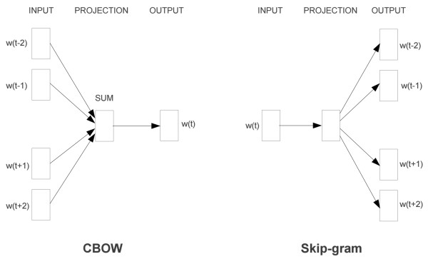
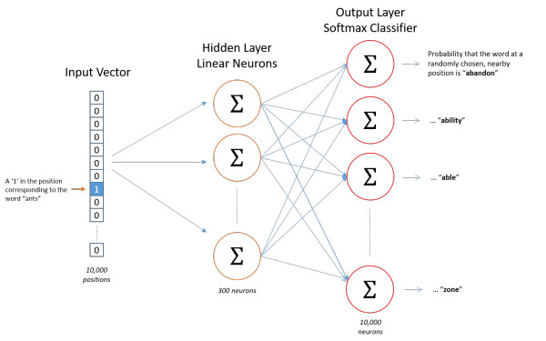
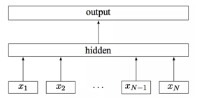

# 知识点总结

## 语素
语素就最小的，有意义的语言单位。而不是独立运用的语言单位。它是构成词语的材料。如：天，地，人，琵琶，怂恿，茉莉，吉普，坦克，芭蕾，凡士林，白兰地等。


## 向量化
- 概念：将非数值型数据转换为数值型数据。
- 目的：使得机器学习模型可以直接处理这些非数值型数据。
- 应用：文本分类，情感分析，机器翻译等任务中。


## 文本向量化
- 文本向量化，将文本转换为数值特征的表示形式，使得机器学习模型可以直接处理这些文本数据。
首先，机器学习模型是无法直接处理字符等非数值型数据的，所以，需要将非数值型数据转化为数值型数据，以便机器学习模型能够直接处理这些非数值型数据。我们将这一转化过程称之为“向量化”。
文本向量化，既是将文本转换为数值特征的表示形式。

- 文本向量化，能够提取文本的语义信息，对于机器来说，理解文本的含义是一个挑战，因为机器不能直接理解文本。
其次，机器学习模型并不能直接理解文本，对于机器学习模型来说，理解文本是一个非常挑战性的任务。但是，我们可以通过文本向量化，将文本中的单词/短语/句子/转化为向量表示。
这些向量特征，不仅考虑了词汇信息，还融入了上下文关系和语义信息。因此，机器模型可以从这些向量特征中学习到文本的含义和语义关系，从而提高文本处理的准确性和效果。

- 文本向量化，能够降低数据的维度和稀疏性。
再次，在自然语言处理中，文本数据通常具有高纬度和稀疏性的特点，这给机器学习模型带来了非常大的挑战，高纬度会增加机器学习模型的复杂度和计算成本，稀疏性会降低模型的训练效率和模型准确度。
文本向量化还有助于降低数据的维度和稀疏性。通常，我们将文本映射到一个较低维度的向量空间中，同时保留文本的主要特征。从而提高机器学习模型的效率和效能。

- 文本向量化，能够更好地刻画文本之间的关系。
最后，文本向量化可以更好的刻画文本之间的关系。例如，我们可以通过计算文本向量之间的距离，来衡量文本之间的相似度。这种相似度度量，可以用于文本分类，文本聚类，文本推荐等任务中。

  
## 文本向量化的原则
- 保留文本的主要特征：在向量化过程中，需要保留文本的主要特征，以便机器学习模型能够从这些特征中学习到文本的含义和语义关系。
- 向量维度相同：在向量化过程中，需要保持每个语素单位的向量维度，我们称这个n维向量空间为一个语义空间。


## 文本向量化方法
- 独热编码：将每个单词表示为一个向量，其中只有一个元素为1，其余元素为0。
- 词袋模型：将每个单词表示为一个向量，其中每个元素表示该单词在文本中出现的次数。
- 词嵌入：将每个单词表示为一个向量，其中每个元素表示该单词在语义空间中的位置。

- TF-IDF：将每个单词表示为一个向量，其中每个元素表示该单词在文本中的权重，权重由词频和逆文档频率决定。

## one-hot编码
> one-hot编码，将每个词表示为一个向量，其中只有一个元素为1，其余元素为0。
> 使用N位状态寄存器对N个状态进行编码，每个状态由其独立的寄存器位表示， 并且任意时刻只有一位是有效的（即设置为1）。

- 统计词表：
  - 首先根据语料统计一个词表或者字表m。
  - 通常也会将低频词裁剪掉，选取n个词作为词表。
  - 如：{"词1": 1, "词2": 2}，key：词，value: 标记，序号。

- 确定语料大小：
  - 一般选择语料长度较大的作为语料长度。
  - 不满足该长度的语料，使用"PAD"进行填充，超过该长度的进行裁剪。

- 确定未知预料标记：不在词表中的词，标记为”UNK”。

- 确定词表：
  - 需要在统计词表的基础上加上"UNK"和"PAD"两个标记。所以，词表大小为n+2。
  - 如：{"PAD": 0, "词1": 1, "词2": 2, "UNK": 3}。

- 确定词向量维度
  - 对于one-hot编码，词向量维度 = 词表大小。
  - 每个维度表示词表中的每个词，当某个词出现时，标记为1。其余的皆为0。
  - 如：[0,0,1,0]表示词表中的第三个词。

- 语料分词：对每条语料进行分词。
  - 第一种分词：直接分割每个字作为一个基本语素。
  - 第二种分词：将每个词作为一个基本语素。这个词是有词表支撑的。
  - 第三种分词：在第二种基础之上，增加命名实体词表。

- 向量化：将一句话转化为数值特征表示。
  - 使用one-hot编码，每个词用一个向量表示，初始化为[0] * n+2。
  - 根据词表中该次的序号，标记该向量中对应位置为1。

- 向量拼接：将每个词向量拼接成一句话的向量。
  - 第一种方式：将词向量组成二维空间，sentence_length * vector_size。如：[0,0,1,0]和[0,1,0,0] 拼接成 [[0,0,1,0],[0,1,0,0]]。
    sentence_length一般设置成固定值，从而保证送入模型中的语料大小一致，不足的使用padding，超过的进行截取。
  - 第二种方式：将词向量首尾拼接。concat物理拼接。如：[0,0,1,0]和[0,1,0,0] 拼接成 [0,0,1,0,0,1,0,0]。
  - 第三种方式：将词向量对位相加。如：[0,0,1,0]和[0,1,0,0] 拼接成 [0,1,1,0]。

- 其他使用场景：
  - 在文本向量化是，也可以考虑词频。比如：你好 你好，[0,0,2,0]，表示两个你好[0,1,0,0]对位相加。
  - 也可以不事先准备词表，根据输入的语料临时构建。如：做文本对比任务时，成对输入，词使维度可随时变化。
    - 例1：
      - A：你好吗       [1, 1, 1, 0, 0]
      - B：你心情好吗    [1, 1, 1, 1, 1]
      - 临时构建出来的词表：你好吗心情，词向量：[1,1,1,1,1]。做词向量时，以词表构建全1向量，如果语句中缺失相应的词，则相应的位置为0。
    - 例2：
      - A：我不知道呀 [1, 1, 1, 1, 0, 0]
      - B：谁知道呀   [0, 0, 1, 1, 1, 1]  对于临时词表向量，前两位未在语料中出现，则设置为0.
      - 临时词表：我不知道谁呀。全1词向量：[1, 1, 1, 1, 1, 1].

- 独热编码-缺点
  - 如果有很多词，向量的维度会非常高，且十分稀疏。除了表示词标记的那位为1，其余位置全为0，计算负担很大。被称为"维度灾难"。
  - 无法表示词与词之间的关系，如：词的相似度。
  - 无法表示词的语义信息，如：词的语义相似度。


## 词袋模型
> 词袋模型（Bag of Words，简称BoW）是自然语言处理和信息检索中的一种常用文本表示方法。
> 它将文本表示为一个词的集合，忽略词语的顺序和语法结构，只关注词语的出现频率。

- 概念
  - 词袋模型是一种将文本表示为词频向量的方法。在词袋模型中，文本中的每个词都被视为一个特征，而文本则被表示为一个向量，向量中的每个元素对应于特定词的出现次数。
  - 重要性在于：
    - 词袋模型能够将非结构化的文本数据转换为结构化的数值数据，便于机器学习模型的训练和预测。 
    - 词袋模型简单易用，适用于各种自然语言处理和信息检索任务，例如文本分类、情感分析、文档聚类等。
- 构建步骤
  1. 分词：将文本切分成词的序列。
  2. 建立词典：统计所有文档中出现的不重复词，并形成词典。 
  3. 向量化：将每个文档表示为词频向量，向量的每个元素对应词典中的一个词，其值为该词在文档中的出现次数。
- 应用场景
  - 词袋模型广泛应用于自然语言处理和信息检索领域的各种任务。
  - 包括：
    - 文本分类：将文本表示为词频向量，然后使用分类算法进行分类。
    - 情感分析：判断文本中表达的情感倾向，例如正面、负面或中性。 
    - 文档聚类：根据文本内容的相似性将文档分组。
- 示例
```python
import numpy as np

# 示例文本数据
documents = [
    '我 喜欢 编程，编程 是 一门 有趣的技术',
    '我 喜欢 旅游，旅游 可以 放松 心情',
    '编程 和 旅游 都是 我的 爱好'
]

# 分词
def tokenize(documents):
    tokenized_documents = [doc.split() for doc in documents]
    return tokenized_documents

# 建立词典
def build_vocabulary(tokenized_documents):
    vocabulary = set()
    for doc in tokenized_documents:
        vocabulary.update(doc)
    return sorted(vocabulary)

# 向量化
def vectorize(tokenized_documents, vocabulary):
    vectors = np.zeros((len(tokenized_documents), len(vocabulary)))
    for i, doc in enumerate(tokenized_documents):
        for word in doc:
            vectors[i, vocabulary.index(word)] += 1
    return vectors

# 分词示例
tokenized_documents = tokenize(documents)
print('分词结果：', tokenized_documents)

# 建立词典示例
vocabulary = build_vocabulary(tokenized_documents)
print('词典：', vocabulary)

# 向量化示例
vectors = vectorize(tokenized_documents, vocabulary)
print('向量化结果：\n', vectors)
```


## 预训练词向量模型
### 概念
- 工业界中，主要使用的预训练模型包括两种：一种以word2vec为代表的预训练词向量；另一种是以BERT为代表的预训练语言模型。
- 用途：前者通常作为词语表示输入的初始化，后接网络层。后者既可以同样后接，也可以直接接softmax/crf等进行解码。
- 主题：围绕预训练词向量模型这一主题，介绍预训练词向量模型的常用方法，评估和应用方式，领域的迁移变体，训练工具和词向量文件。
- 示例：word2vec，fasttext。
### 背景：
- 自2010年依赖，神经语言模型就逐渐进入人们的眼球，以NNLM为最初的典型代表的神经网络模型，极大的推动了NLP领域的发展。
- 实际上，早期词向量的研究通常来源于语言模型，比如NNLM和RNNLM，其主要目的是语言模型，而词向量只是一个副产物。著名的harris分布式假设提供了一个局部统计信息的理论基础。

### 三种典型的预训练词向量模型
#### 1. word2vec
- word2vec：将词映射到向量空间中，向量空间中的向量表示词的语义信息。词向量表示语义空间。

- 目的：我们希望得到一种词向量，使得向量之间反映出语义关系。 比如，我们可以使用余弦相似性度量两个词的近似关系。
  - 向量的相似性反应词义的相似性
    - cos(你好, 您好) > cos(你好, 天气）
    - cos(北京, 天气） > cos(北京, 上海）
  - 向量可以通过数值运算反映词之间的关系
    - 国王 - 男人 = 皇后 - 女人

- 原则：向量的维度应该是固定的。即每个词都由固定大小的词向量表示。

- 基本概念理解：word embedding, word vector, word2vector
  1. 广义上来说没有区别，二者都是表示将词转换为词向量
  2. 按照模型训练流程详细划分：word embedding是指随机初始化的词向量或者字向量。word vector指训练好的词向量。
  3. word2vector：是指一种训练word embedding的方法，使得其向量具有一定的性质（语义空间）。




> word2vec是2013年Google开源的一款用于词向量计算的工具，通过内置的语言模型训练目标，可以将中间层得到的词向量权重矩阵进行抽离，形成每个词对应的向量化表示。
- 包括CBOW和Skip-gram两种训练方式
- 前者通过周围词预测中心词，后者通过中心词预测上下文。


- cbow训练流程：
  - 输入层存储上下文单词的onehot编码，假设输入单词的词表大小为V，词向量空间dim为V，上下文单词个数为C。
  - 初始化输入权重矩阵W，W矩阵size：V*N，N为设置的隐藏层大小。 目标矩阵。
  - 所有输入单词的onehot分别乘以共享的输入权重矩阵W，将得到的向量相加求平均，作为隐藏层向量，size为1*N。
  - 隐藏层向量乘以输出权重矩阵W'，W'矩阵size：N*V。得到向量1*V。
  - 经过激活函数softmax处理，得到V-dim概率分布。
  - 计算损失，反向传播更新权重矩阵W和W'。
    - 将输出概率分布与预期onehot向量做比较，计算loss（交叉熵，平均距离，MSE等）。
    - 根据损失函数定义，计算梯度，并选择优化器，反向传播更新权重矩阵W和W'.
  - W矩阵：最终训练得到的W矩阵，就是所有单词的word embedding. 任何一个单词的onehot乘以这个矩阵，都会得到自己的词向量。


- skip-gram训练流程：
  - 假设一个语料： “The dog barked at the mailman”，我们选择"dog"作为input_word。
  - 此处与cbow层的不同在于，输入层是中心词input_word的onehot编码。假设输入单词的词表大小为V，词向量空间为V。
  - 定义skip_windows参数，它表示我们从当前input_word的一侧（左边和右边）选取词的数量。
    - 当skip_windows=2，会得到一个窗口['The', 'dog'，'barked', 'at']。
  - 定义num_skips参数，它表示我们从得到的整个窗口中选取多少个不同的词作为我们的output_word，
    - 当num_skip=2时，会得到两组(input_word, output_word) = ('dog', 'The'), ('dog', 'barked')。
  - 输出结果代表着，output_word跟input_word同时出现的可能性。
  - =====
  - 所以输入单词input_word是一个1 * V的onehot编码。
  - 初始化输入权重矩阵W，W矩阵size：V*N,N为设置的隐藏层大小。 目标矩阵。
  - input_word的onehot乘以W，得到一个隐藏层向量，其size为1*N。
  - 隐藏层向量乘以输出权重矩阵W'，W'矩阵size：N * V。得到向量1*V。
  - 经过激活函数softmax处理,得到V-dim概率分布。
  - 计算损失，反向传播更新权重矩阵W和W'。
    - 将输出概率分布与预期onehot向量做比较，计算loss（交叉熵，平均距离，MSE等）。
    - 根据损失函数定义，计算梯度，并选择优化器，反向传播更新权重矩阵W和W'.

- 训练方法的选择
  - 通常，在训练词向量时候，会根据语料的大小来选择相应的训练方法。
  - 针对小型的数据集，可以用CBOW算法，该方法对于很多分布式信息进行了平滑处理，将一整段上下文信息视为一个单一观察量，对于小型的数据集，这一处理是有帮助的。
  - 相比之下，大型数据集，可以用Skip-Gram模型，该方法将每个“上下文-目标词汇”的组合视为一个新观察量，这种做法在大型数据集中会更为有效。

- word2vec的原理：通过训练语言模型，将词映射到向量空间中，向量空间中的向量表示词的语义信息。
- word2vec的优点：考虑了词的上下文信息，能够处理词的语义信息。
- word2vec的缺点：没有考虑词的上下文信息，且没有考虑词的语义信息。
- word2vec的改进：fasttext和glove。


#### 2. fasttext
> - fastText是Facebook于2016年开源的一个词向量计算和文本分类工具。
> - 将整篇文档的词及n-gram向量叠加平均得到文档向量，然后使用文档向量做softmax多分类。
> - 优化方法：包括字符级n-gram特征的引入以及分层Softmax分类两种。

> 与CBOW一样，原本的fastText模型包括输入层、隐含层、输出层。
> 输入都是多个经向量表示的单词，输出都是一个特定的目标，隐含层都是对多个词向量的叠加平均。
> 不同的是，CBOW的输入是目标单词的上下文，fastText的输入是多个单词及其n-gram特征，这些特征用来表示单个文档，
> CBOW的输入单词被onehot编码过，fastText的输入特征是经embedding化的。
> CBOW的输出是目标词汇，fastText的输出是文档对应的类标。

> 如果将该类标替换成中间目标词，那么就可以得到wordvec的升级版，即单纯的词向量模型。例如，word2vec把语料库中的每个单词当成原子的，它会为每个单词生成一个向量。这忽略了单词内部的形态特征。

> fasttext使用了字符级别的n-grams来表示一个单词。
> 对于单词“apple”，假设n的取值为3，则它的trigram有“<ap”, “app”, “ppl”, “ple”, “le>”，其中，<表示前缀，>表示后缀。
> 于是，我们可以用这些trigram来表示“apple”这个单词，进一步，可以用这5个trigram的向量叠加来表示“apple”的词向量。

> 因此，因为它们的n-gram可以和其它词共享，对于训练词库之外的单词，能够解决或者oov词，这也是在当前很多文本分类、推荐场景中会优先选用fastText作为训练方法。

- fasttext的词向量训练方法，是基于词袋模型和神经网络模型进行训练的。

- fastText模型架构 <br>

  - 其中x1,x2,…,xN−1,xN表示一个文本中的n-gram向量，每个特征是词向量的平均值。
  - 这和前文中提到的cbow相似，cbow用上下文去预测中心词，而此处用全部的n-gram去预测指定类别。
- 算法原理： FastText算法的核心思想是：利用词袋模型（包括n-gram）快速生成文本的特征向量，再通过浅层神经网络进行分类学习。
- 计算流程
  - 文本预处理：对原始文本进行分词、去除停用词、转换为小写等操作。
  - 构建词袋模型：使用词袋模型构建特征向量，计算文本中每个n-gram的出现次数，形成词频向量。
  - 生成特征向量：将词频向量与词嵌入向量（如Word2Vec预训练向量）进行运算（embedding化），得到最终的文本特征向量。
  - 词向量训练：使用特征向量作为输入，通过神经网络模型进行训练，得到每个n-gram的词向量。
  - 反向传播：通过反向传播算法更新网络参数，最小化交叉熵损失函数。
  - 文本分类预测：将待分类文本转换为词向量，通过训练好的神经网络模型进行分类预测。
```python
import fasttext
from sklearn.metrics import classification_report
from sklearn.model_selection import train_test_split

# fasttext训练
model = fasttext.train_unsupervised('data.txt', model='skipgram')
model.save_model("model.bin")
```


#### 3. glove
- glove是斯坦福大学开源的词向量训练工具，其训练词向量时，考虑了词与词之间的共现关系。
- glove的词向量训练方法，是基于共现矩阵和神经网络模型进行训练的。
共现矩阵：V * V
- 共现矩阵：词与词之间的共现关系
- 矩阵中的值：每个词共同出现的次数
- 我们可以计算共现矩阵的共现概率。


#### 4. 基于神经网络模型进行训练
词向量的训练，包含在神经网络语言模型的训练之中，作为其副产品输出。embedding层只是众多模型层中的一层。
神经网络语言模型的输入，

- 准备输入
- 搭建模型

- 目标：根据一组词，预测下一个词。如：“天王盖地” —> 输出："虎"。
- 特点
  - 词向量是实现这种目标下的副产品
  - 因为模型中有其他层的存在，模型的效果还会有其他层的效果


### 模量量化（优化模型，降低模型维度）
1. huffman树
- 替代方案：历史上减少运算量的工程方法，现在可以不用了
- 建立词频的huffman树，将词频高的词放在树的根部，词频低的词放在树的叶子

2. 负采样 negative sampling
正样本保留，负样本随机选。
- 负样本好找，正样本不好找
- 负采样：将词频高的词作为正样本，将词频低的词作为负样本
- 替代方案：历史上减少运算量的工程方法，现在可以不用了


### 词向量训练总结
- 根据词语词之间关系的某种规律，指定训练目标
- 设计模型，以词向量为输入
- 词向量的训练都是从随机初始化开始训练
- 训练过程中，词向量作为参数不断调整，获取一定的语义信息
- 使用训练好的词向量做下游任务

### 词向量存在的问题
- 词向量是“静态”的。每个词使用固定向量，没有考虑前后文。这种事不完善的。
- 一词多义的情况在训练的时候容易混淆。西瓜 - 华为  - 华为。向量近似，容易混淆
- 影响效果的因素很多
  - 维度选择
  - 随机初始化
  - skip-gram
  - cbow
  - glove
  - 分词质量
  - 词频截断
  - 窗口大小
  - 迭代次数
  - 停止条件
  - 预料质量等
- 没有好的直接评价指标。常需要用下游任务来评价。所以现在都是建议在模型中随机初始化后，参与模型训练。（以前很鼓励单独训练词向量，现在不鼓励）

## 词向量应用
### 句子应用
- 将一句话或者一段文本分成若干个词
- 找到

### K-Means
- 随机训责k个点作为初始质心
- repeat
  - 计算每个点与这k个质心的距离
  - 将每个点指派到最近的质心，形成k个簇
  - 重新计算每个簇的质心
- until
  - 质心不发生变化或者质心变化小于阈值
- 优点
  - 速度很快，可以支持很大量的数据
  - 样本均匀特征明显的情况下，效果不错
- 缺点
  - 认为设定聚类数量
  - 初始化中心影响效果，导致结果不稳定
  - 对于个别特殊样本敏感，会大幅影响聚类中心位置。
  - 不适合多标签(模棱两可的样本)或者样本较为离散的数据
- 使用技巧
  - 先设定较多的聚类类别
  - 聚类结束后计算类内平均距离(与质心的距离)
  - 排序后，舍弃类内平均距离较长的类别
  - 计算距离：欧氏距离，余弦距离，或者其他距离
  - 短文本聚类：记得先去重，以及其他预处理。

词向量总结：
1. 质变：将离散的字符转化为连续的数值
2. 通过向量的相似度代表语义的相似度
3. 词向量的训练基于很多不完全正确的假设，但是据此训练的词向量是有意义的
4. 使用五标注的文本的一种好方法

词向量现在更多的被主流方法代替：预训练模型。

# 作业要求

基于词向量Kmeans使用代码，结合kmeans使用技巧，计算平均距离，舍弃类内平均距离较长的类别。

# 一、需求分析

根据作业要求，确定需求实现目标，提取需求约束条件，拆分成子模块进行实现。

## US_20240713_05_001_1

- 需求背景
- 需求描述
- 约束条件

## 数据标注


# 二、需求设计

## US_20240713_05_001_1

### 背景

### 实现方式

### 结果评估

# 三、需求实现

## 需求1

### byTorch

Model 1实现

### byMySelf

Model 1实现

## Requirement 2

### byTorch

Model 2实现

### byMySelf

Model 2实现

# 四、模型测试

## Model 1

### 测试用例

### 测试结果

### 结果评估

## Model 2

### 测试用例

### 测试结果

### 结果评估

# 五、模型部署与维护

## 部署方式

## 维护方式

# 六、模型优化思考

